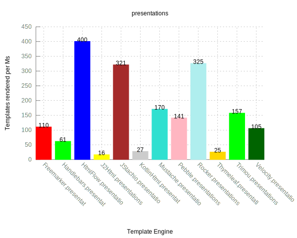
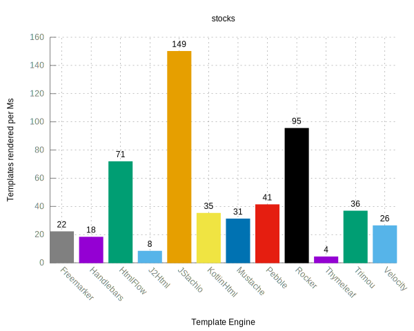
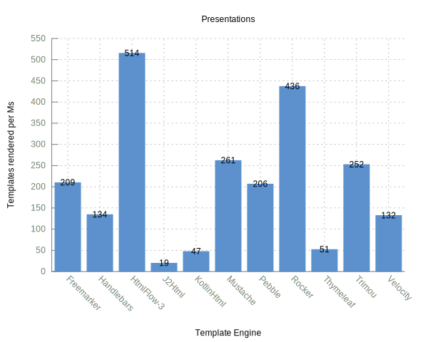

template-benchmark
================

JMH benchmark for popular Java template engines:

* [Freemarker](http://freemarker.org/)
* [Handlebars](https://github.com/jknack/handlebars.java)
* [Mustache](https://github.com/spullara/mustache.java)
* [Pebble](http://www.mitchellbosecke.com/pebble)
* [Rocker](https://github.com/fizzed/rocker)
* [Thymeleaf](http://www.thymeleaf.org/)
* [Trimou](http://trimou.org/)
* [Velocity](http://velocity.apache.org/)
* [j2Html](https://j2html.com/)
* [KotlinX Html](https://github.com/Kotlin/kotlinx.html)
* [HtmlFlow](https://github.com/xmlet/HtmlFlow)
* [JStachio](https://github.com/jstachio/jstachio)

Running the benchmark
======================

1. Download the source code and build it (`mvn clean install`)
2. (Optional) To run a benchmark for a single template, such as Mustache, use `java -jar target/benchmarks.jar Mustache`
3. Run the benchmark for `presentations` or `stocks` workload. E.g. for : `presentations`
```bash
java -jar target/benchmarks.jar -i 4 -wi 4 -f 1 -r 2 -w 2 -rff results/results-presentations.csv -rf csv -tu ms presentations
```

Generating plot
===============
1. Run benchmarks while exporting results to csv with:
   * `java -jar target/benchmarks.jar -rff results/results-presentations.csv -rf csv presentations`
   * `java -jar target/benchmarks.jar -rff results/results-stocks.csv -rf csv stocks`
2. Use gnuplot to generate plot with `gnuplot benchmark.plot`. This will output `results-presentations.svg` and `results-stocks.svg`.

`Presentations` benchmark was imported from [spring-comparing-template-engines](https://github.com/jreijn/spring-comparing-template-engines).

Rules of Template Engine Configuration
======================================
It is imperative that each template engine is configured in way to reflect real-world usage as opposed to it's *optimal* configuration. Typically this means an out-of-the-box configuration.

To strive for a common set of features across template engines, the following configurations are expected:
* Disabling of HTML escaping
* Template loaded from classpath prior to actual benchmark

Interpreting the Results
========================
The benchmarks measure throughput, given in "ops/time". The time unit used is seconds.
Generally, the score represents the number of templates rendered per second; the higher the score, the better.

Example Results (2024, with HtmlFlow 4 and JStachio)
===============================

**Upgraded all releases of templates including HtmlFlow to 4.3 and add new template engine JStachio**

These tests were performed in Github Actions
with `Ubuntu 22.04, 4 CPU and 16 GB RAM` according to [GitHub-hosted runners for Public repositories](https://docs.github.com/en/actions/using-github-hosted-runners/about-github-hosted-runners/about-github-hosted-runners#standard-github-hosted-runners-for-public-repositories).


Plots are generated from the data collected in this [run](https://github.com/xmlet/template-benchmark/actions/runs/7670044064) 

<table>
<tr>
<td></td>
<td></td>
</tr>
</table>


Example Results (2023, with HtmlFlow 3.5)
===============================

**These tests differ from the 2019 results in the upgraded releases of JMH
and Kotlin standard libraries from 1.2.61 to 1.8.20** (Kotlin included 
several optimizations to enhance type safe assertions).

These tests were performed on a local machine with the following specs:

```
Mac OS Version 13.4.1
Apple MacBook M1 Pro, 8 Cores and 16 GB RAM
OpenJDK Runtime Environment Corretto-17.0.5.8.1 
OpenJDK 64-Bit Server VM Corretto (build 17.0.5+8-LTS)
```

<table>
<tr>
<td></td>
<td></td>
</tr>
</table>


Example Results (2019, with HtmlFlow 3.5)
===============================

These tests were performed on a local machine with the following specs:

```
Mac OS X Version 10.14.1
3 GHz Intel Core i7 Quad core
Java(TM) SE Runtime Environment 18.3 (build 10.0.1+10)
Java HotSpot(TM) 64-Bit Server VM 18.3 (build 10.0.1+10, mixed mode)
```

<table>
<tr>
<td></td>
<td></td>
</tr>
</table>
